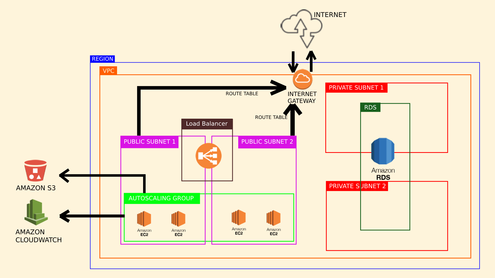

# Computação em Nuvem - Projeto

Insper - Instituto de Pesquisa e Ensino

Computação em Nuvem

Professor Rodolfo Avelino e Tiago Demay

6° semestre de Engenharia da Computação

Arthur Boschini da Fonseca

## Introdução

Este projeto tem como objetivo a criação de uma aplicação web que utiliza os serviços da AWS (Amazon Web Services) para ser executada. A aplicação consiste em um CRUD básico de uma lista de tarefas, onde o usuário pode criar, ler, atualizar e deletar tarefas. A aplicação foi desenvolvida utilizando o framework FastAPI, que é um framework web para Python, e o banco de dados utilizado é um RDS (Relational Database Service), do tipo MySQL.

Recursos AWS utilizados:

- Security Groups
- VPC (Virtual Private Cloud)
- Subnets
- Load Balancer
- EC2 (Elastic Compute Cloud)
- Auto Scaling
- CloudWatch Alarms
- RDS (Relational Database Service)

## Como executar o projeto?

#### Pré-requisitos

Para executar o projeto, é necessário ter o Terraform instalado na máquina.
Para instalar o Terraform, basta seguir as instruções do site oficial:

- https://learn.hashicorp.com/tutorials/terraform/install-cli

É necessário possuir a AWS CLI (Command Line Interface) instalada e configurada na máquina.
Para instalar a AWS CLI, basta seguir as instruções do site oficial:

- https://docs.aws.amazon.com/cli/latest/userguide/cli-chap-install.html

Há a necessidade, também, de criar um usuário IAM (Identity and Access Management) na AWS, com permissões de administrador. Para criar um usuário IAM, basta seguir as instruções do site oficial:

- https://docs.aws.amazon.com/IAM/latest/UserGuide/id_users_create.html

Por fim, é necessário criar um S3 Bucket na AWS, que será utilizado para armazenar o backend do projeto.
Para criar um S3 Bucket, basta seguir as instruções do site oficial:

- https://docs.aws.amazon.com/AmazonS3/latest/userguide/create-bucket-overview.html

**OBS:**
**O BUCKET NECESSÁRIAMENTE DEVE SER CHAMADO DE "arthurfonsek-bucket".**

#### Executando o projeto

Para executar o projeto, basta seguir os seguintes passos:

0. Certifique-se de que os pré-requisitos foram cumpridos.
1. Clone o repositório do projeto.
2. Entre na pasta do projeto.
3. Rode o comando:

```
terraform init --auto-approve
```

- Deve demorar aproximadamente 20 minutos para que o comando seja executado.

4. Após a execução do comando, confira o prompt de comando. Nos outputs, haverá um output chamado "application_url". Copie o valor desse output e insira no navegador. Ele é composto pelo DNS do load balancer, seguido de "/docs". Exemplo:

```
http://arthurfonsek-lb-123456789.us-east-1.elb.amazonaws.com/docs
```

5. Entre no link copiado e teste a aplicação.
6. Para destruir a infraestrutura criada, rode o comando:

```
terraform destroy --auto-approve
```

#### Security Groups

Foi criado um único security group, chamado de "arthurfonsek-sg", que permite que as instâncias EC2, load balancer e RDS se comuniquem entre si.

#### VPC

Uma VPC (Virtual Private Cloud) é um serviço que permite a criação de uma rede virtual na nuvem da AWS. A VPC permite que o usuário tenha controle sobre o ambiente virtual, como por exemplo, a escolha do endereço IP, criação de sub-redes e configuração de tabelas de roteamento e gateways.

Foi criada uma VPC onde todos os recursos do projeto estão localizados. A VPC possui um CIDR de '10.0.0.0/16'.

Todos os recursos criados e mencionados abaixo estarão dentro da VPC.

#### Subnets

Foram criadas 4 subnets no total, sendo 2 públicas e 2 privadas.
As subnets públicas, que estão localizadas em diferentes regiões (a fim de garantir uma alta disponibilidade), têm o intuito de permitir a criação de um load balancer elástico, que servirá como ponto de entrada para o usuário.
Um internet gateway e uma tabela de roteamento foram criados para que as subnets públicas possam se comunicar com a internet.
Por sua vez, as subnets privadas, são necessárias para que o RDS as utilize como sub-rede de banco de dados.
Abaixo, segue uma tabela com as informações das subnets criadas:

| Nome            | CIDR          | Região    | Tipo     |
| --------------- | ------------- | ---------- | -------- |
| pub_subnet      | 10.0.1.0/24   | us-east-1a | pública |
| pub_subnet-2    | 10.0.2.0/24   | us-east-1b | pública |
| private_subnet  | 10.0.101.0/24 | us-east-1a | privada  |
| private_subnet2 | 10.0.102.0/24 | us-east-1b | privada  |

#### Load Balancer

O load balancer criado, chamado de "arthurfonsek-lb", é um serviço que distribui o tráfego de entrada entre as instâncias EC2.
O load balancer criado é do tipo "application load balancer", que balancea a carga de tráfego entre as instâncias EC2. O load balancer foi configurado para escutar na porta 80, que é a porta padrão para requisições HTTP.

#### Aplicação

A aplicação instalada nas instâncias EC2 é um CRUD básico de uma lista de tarefas. A instalação da aplicação é feita através de um script na inicialização da instância, na variável "user_data" do "launch template", que será explicado mais adiante.

#### Auto Scaling e CloudWatch Alarms

O auto scaling é um serviço que permite que o número de instâncias EC2 seja aumentado ou diminuído de acordo com a demanda.
A fim de monitorar o auto scaling, foram criados dois CloudWatch Alarms, um para aumentar o número de instâncias EC2 e outro para diminuir o número de instâncias EC2.

- O CloudWatch Alarm para aumentar o número de instâncias EC2 é disparado quando a média de CPU das instâncias for **maior que 70%** por 1 minuto.
- Por sua vez, o CloudWatch Alarm para diminuir o número de instâncias EC2 é disparado quando a média de CPU das instâncias for **menor que 10%** por 1 minuto.

O auto scaling é configurado para obedecer os CloudWatch Alarms, ou seja, quando o CloudWatch Alarm para aumentar o número de instâncias EC2 for disparado, o auto scaling aumentará o número de instâncias EC2 em 1.
Da mesma forma, quando o CloudWatch Alarm para diminuir o número de instâncias EC2 for disparado, o auto scaling diminuirá o número de instâncias EC2 em 1.

#### RDS (a.k.a Banco de Dados)

O banco de dados utilizado é um RDS, do tipo MySQL, onde as duas sub-redes privadas estão associadas a ele.

#### Infraestrutura (desenho)



## Análise de custos via AWS Price Calculator

###### EC2

Número de instâncias: 5
Instância: t2.micro
Região: us-east-1
Sistema operacional: Linux
Locação: Instâncias compartilhadas
Opção de pagamento: EC2 Instance Savings Plans (3 anos, sem pagamento antecipado)

Justificativa para as escolhas:

- O número de instâncias foi escolhido para que o auto scaling funcione corretamente. (Número mínimo de instâncias: 2, número máximo de instâncias: 5)
- t2.micro atende os requisitos da aplicação: 1 vCPU e 1 GiB de memória é mais do que suficiente para a aplicação, além de ser uma instância barata.
- A opção de pagamento escolhida foi a EC2 Instance Savings Plans, pois é a opção mais barata para o tipo de instância escolhida.

Custo inicial total: $0,00 USD
Custo mensal total: $18,25 USD

###### Load Balancer

Número de load balancers: 1
Tipo de load balancer: Application Load Balancer
Região: us-east-1
Bytes Processados: 20 GB/mês
Número médio de novas conexões via load balancer: 10/minuto
Média de durabilidade das conexões: 15 minutos
Número médio de solicitações via load balancer: 10/segundo

Justificativa para as escolhas:

- Precisamos de apenas 1 load balancer, para fazer o balanceamento de carga entre as instâncias EC2 das subredes públicas.
- Ele é do tipo Application Load Balancer, pois é o tipo que permite o balanceamento de carga entre as instâncias EC2.
- O número de bytes processados foi suposto, pois não havia como saber o número exato de bytes processados. Como a aplicação é simples, supôs-se que o número de bytes processados seria baixo.
- O número médio de novas conexões também foi suposto, suportando até 10 novas conexões por minuto, o que é um número razoável para a aplicação.
- A média de durabilidade das conexões foi suposta, suportando até 15 minutos de conexão, o que é um tempo razoável para a utilzação da aplicação, visto que a aplicação é um simples CRUD de uma lista de tarefas.
- O número médio de solicitações também foi suposto, suportando até 10 solicitações por segundo, contando que cada nova conexão faça 10 solicitações por segundo, o que é um número razoável para a aplicação.

Custo inicial total: $0,00 USD
Custo mensal total: $16,73 USD

###### VPC

Network Address Translation (NAT) Gateway: habilitado
Número de gateways NAT: 1
Dados processados pelo gateway NAT: 5 GB/mês
IPAM: habilitado
Número de endereços IP ativos: 5

Justificativa para as escolhas:

- O NAT Gateway foi habilitado, pois é necessário para que as subredes públicas possam se comunicar com a internet.
- O número de gateways NAT foi suposto, pois não havia como saber o número exato de gateways NAT. Como a aplicação é simples, supôs-se que o número de gateways NAT não seja maior que 1.
- O número de dados processados pelo gateway NAT foi suposto, pois não havia como saber o número exato de dados processados pelo gateway NAT. Como a aplicação é simples, supôs-se que o número de dados processados pelo gateway NAT não seja maior que 5 GB/mês.
- O IPAM foi habilitado, pois é necessário para que o usuário tenha controle sobre o ambiente virtual.
- O número de endereços IP ativos está de acordo com o número de instâncias EC2.

Custo inicial total: $0,00 USD
Custo mensal total: $33,28 USD

###### RDS

Número de instâncias: 1
Tipo de instância: db.t2.micro
Região: us-east-1
Utilização: 24 horas por dia, 7 dias por semana
Multi-AZ: habilitado
Modelo de preço: instância sob demanda
Armazenamento: 20 GB
Tipo de armazenamento: General Purpose (SSD gp2)
Armazenamento de backup: 140 GB

Justificativa para as escolhas:

- Precisamos de apenas 1 instância de banco de dados.
- O tipo de instância escolhido consegue agregar todos os requisitos da aplicação, além de ser uma instância barata.
- A utilização é 24 horas por dia, 7 dias por semana, pois a aplicação deve estar disponível o tempo todo.
- O Multi-AZ foi habilitado, pois é necessário para que o banco de dados tenha alta disponibilidade em diversas regiões.
- O armazenamento foi suposto, pois não havia como saber o número exato de armazenamento. Como a aplicação é simples, supôs-se que o número de armazenamento não seja maior que 20 GB.
- O armazenamento de backup leva em conta que o último backup fica disponível por 7 dias, e cada backup é feito a cada 24 horas. Portanto, o armazenamento de backup é de 7 x 20 GB = 140 GB para garantir que todos os backups fiquem disponíveis.

Custo inicial total: $0,00 USD
Custo mensal total: $64,62 USD

###### S3

S3 Standard: habilitado
Armazenamento S3: 1GB/mês
Número de solicitações: 2000/mês (1000 para GET e 1000 para PUT e POST)

Justificativa para as escolhas:

- O S3 Standard com 1GB de armazenamento é o suficiente para armazenar o backend da aplicação, pois o único arquivo que será armazenado é o arquivo "terraform.tfstate", que possui poucos KB, portanto, 1GB é mais do que suficiente.

###### CloudWatch

Número de métricas: 2
APIs - GetMetricData: 2

Justificativa para as escolhas:

- Utilizamos apenas 2 métricas, que são os CloudWatch Alarms para aumentar e diminuir o número de instâncias EC2.
- Utilizamos apenas a API GetMetricData, que é a API utilizada para obter métricas do CloudWatch.

Custo inicial total: $0,00 USD
Custo mensal total: $0,60 USD

###### Elastic IP

Número de instâncias do EC2: 5
Número de endereços Elastic IP por instância: 1
Número de horas que cada EIP está anexado a uma instância do EC2: 24 horas por dia, 7 dias por semana

Justificativa para as escolhas:

- Utilizamos 5 instâncias EC2, portanto, precisamos de 5 endereços Elastic IP.
- Cada instância EC2 precisa de 1 endereço Elastic IP.
- Cada endereço Elastic IP está anexado a uma instância EC2 24 horas por dia, 7 dias por semana.

Custo inicial total: $0,00 USD
Custo mensal total: $0,00 USD

## Total

Custo inicial total: $0,00 USD
Custo mensal total: $134,30 USD
Custo anual total: $1.611,60 USD

Justificativa geral:

- O custo inicial é $0,00 USD, pois, por opção, não há custo inicial para os serviços utilizados.
- O custo mensal total é $134,30 USD, o que é um valor razoável para manter uma infraestrutura robusta e escalável na AWS.
- Considerando os custos de uma empresa, se fosse o caso, o custo anual total seria $1.611,60 USD, o que é um valor irrisório para manter os seus serviços de pé.

Valores em BRL - (cotação do dólar em 01/12/2021: R$ 4,88):

- Custo mensal total: R$ 655,10
- Custo anual total: R$ 7.861,20

Abaixo, segue o link para o PDF com a estimativa de custos:
[Download PDF](Estimativa.pdf)

## Possíveis melhorias

- Utilizar um banco de dados NoSQL, como o DynamoDB, que é um banco de dados não relacional, que é mais escalável e mais barato que o RDS.
- Utilizar um serviço de armazenamento de arquivos, como o S3, para armazenar o backend da aplicação, ao invés de utilizar o armazenamento local da instância EC2.
- Utilizar um serviço de cache, como o ElastiCache, para armazenar os dados mais acessados da aplicação, a fim de melhorar a performance da aplicação.
- Utilizar um serviço de CDN (Content Delivery Network), como o CloudFront, para melhorar a performance da aplicação.
- Adicionar testes de stress utilizando o Locust, para testar a aplicação com um número alto de usuários e requests.
